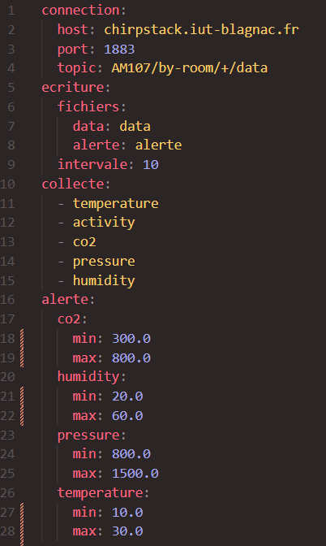
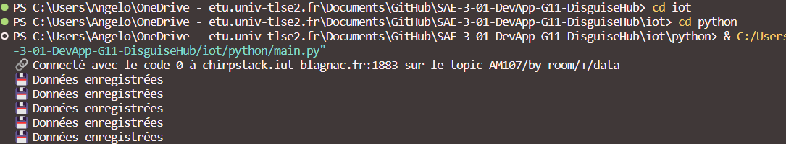
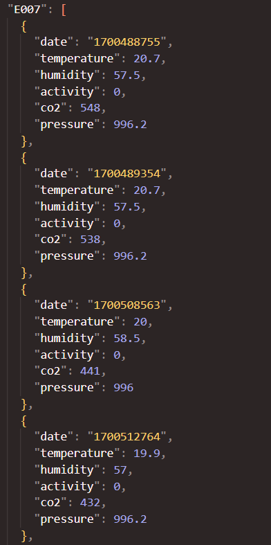
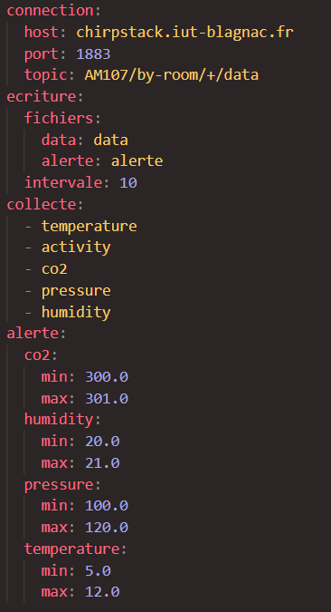
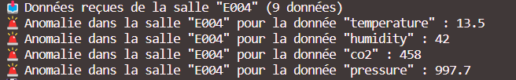
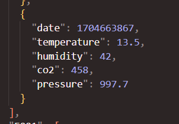

= Document technique pour la partie IoT : PYTHON
:toc:
:toc-title: Sommaire

:Entreprise: Disguise'Hub
:Equipe: 11

.Groupe 11, Auteur : Angelo Nichele, publié le 20/12/2023
Créé pour : Détailler le code Python, pour l'application de gestion des données des capteurs de la société Disguise'Hub

 

== I. Présentation du code
[.text-justify] 
 
Le code Python présentée ici fait partie d'un système de gestion des données de capteurs déployés à l'IUT Blagnac. Son rôle est d'accéder aux données des capteurs, de les traiter selon des paramètres configurables, et d'écrire ces données dans des fichiers. L'application s'interface avec un serveur MQTT pour récupérer les données des capteurs et utilise un fichier de configuration pour définir son comportement.

[NOTE]
Le présent document se concentre sur la partie Python de l'application IoT. Le système global comprend également une application Java qui permet de configurer le comportement de l'application Python et d'afficher les valeurs captées.

Pour ce faire nous avons 4 collaborateurs, afin de développer cette application :

* *_Maxence Krill_*  --- Scrum Master

* *_Marwan Al Masri_* --- Product Owner

* *_Angelo Nichele_*  --- Développeur

* *_Guichel Babela_* --- Développeur

== II. Description des ressources 
[.text-justify]

*Languages utilisés* : Python

*Configuration nécessaire* : Linux, Windows

*IDE* : Visual Studio Code

*Librairies utilisées* : os, yaml, json, signal, threading, sys, time, paho

== III. Fonctionnalités principales
[.text-justify]

Le code Python offre plusieurs fonctionnalités essentielles pour la gestion des données de capteurs. Voici un aperçu de ses principales fonctionnalités :

1. *Lecture du fichier de configuration* : Le code lit un fichier de configuration (config.yaml) pour déterminer son comportement. Ce fichier spécifie des paramètres tels que l'hôte (chirpstack.iut-blagnac.fr) et le port du serveur MQTT (1883), le topic auquel s'abonner (AM107/by-room/+/data), les types de données à collecter (temperature, activity, co2, pressure, humidity), les seuils d'alerte, etc.

2. *Lecture des données MQTT* : Le code se connecte au serveur MQTT (chirpstack.iut-blagnac.fr) et s'abonne au topic spécifié dans le fichier de configuration. Elle extrait les données publiées sur le bus MQTT, les analyse et les traite salle par salle, évitant tout mélange de données.

3. *Gestion de la lecture du bus* : L'application gère la lecture du bus MQTT à une fréquence définie dans le fichier de configuration. Sur les systèmes Unix, elle utilise des appels système pour assurer la régularité de la lecture.

4. *Écriture des données dans des fichiers* : Les valeurs captées sont écrites dans des fichiers au format JSON. L'application prend en charge la conversion des valeurs en UTF-8 pour assurer une lecture correcte par le programme Java.

5. *Détection des dépassements de seuils d'alerte* : L'application surveille les valeurs captées et détecte les dépassements des seuils d'alerte définis dans le fichier de configuration. En cas de dépassement, elle enregistre les données anormales dans des fichiers d'alerte.

== IV. Structure du code
[.text-justify]

Le code Python est structuré en plusieurs fonctions pour faciliter la lisibilité et la maintenance. Voici un aperçu des principales fonctions :

1. *on_connect* : Cette fonction est appelée lors de la connexion au serveur MQTT. Elle gère l'abonnement au topic spécifié dans le fichier de configuration et initialise les intervalles de lecture en fonction du système d'exploitation.

2. *on_message* : Cette fonction est appelée lorsqu'un message est reçu du serveur MQTT. Elle extrait les données, les traite salle par salle, et détecte les dépassements de seuils d'alerte.

3. *write* : Cette fonction gère l'écriture des données dans les fichiers. Elle prend en charge les différences entre les systèmes Unix et Windows pour assurer la portabilité du programme.

4. *unixwrite* : Fonction spécifique à Unix pour appeler la fonction write à intervalles réguliers.

5. *dataload et readfile* : Ces fonctions gèrent la lecture du fichier de configuration et des fichiers de données. Elles initialisent les variables nécessaires au fonctionnement du code.

== V. Analyse technique du code
[.text-justify]

Le code Python fourni présente une application de gestion des données de capteurs, qui se connecte à un serveur MQTT, récupère les données des capteurs, les traite, détecte les alertes et les enregistre dans des fichiers. Voici une analyse détaillée des aspects techniques du code :

=== 1. Imports et Déclaration
[.text-justify]

* Les bibliothèques '*os*', '*yaml*', '*json*', '*signal*', '*threading*', '*sys*', '*time*' sont importées pour diverses fonctionnalités telles que la gestion des fichiers, les signaux, les threads, etc.
* '*paho.mqtt.client*' est importé pour utiliser le client MQTT.

[source,python]
----
# -*- coding: utf-8 -*-
#!/usr/bin/env python3

import os, yaml, json, signal, threading, sys, time
import paho.mqtt.client as mqtt
----

=== 2. Fonctions de Connexion MQTT
[.text-justify]

* '*on_connect*' est appelé lors de la connexion au serveur MQTT et s'occupe de l'abonnement au topic spécifié.
* '*on_message*' est appelé lors de la réception d'un message MQTT, décode le message, traite les données salle par salle, et détecte les alertes.

[source,python]
----
def on_connect(client, userdata, flags, rc):
    # ...
    
def on_message(client, userdata, msg):
    # ...
----

=== 3. Gestion des Données
[.text-justify]

* '*dataload*' initialise les variables globales config, data, et alerte en lisant le fichier de configuration et les fichiers de données.
* '*readfile*' gère la lecture des fichiers de données, les initialise s'ils n'existent pas, et retourne leur contenu.

[source,python]
----
def dataload():
    # ...

def readfile(file):
    # ...
----

=== 4. Écriture des Données
[.text-justify]

* '*write*' écrit les données dans les fichiers, gère les différences entre les systèmes Unix et Windows, et redémarre le timer.
* '*unixwrite*' est une fonction spécifique à Unix pour appeler write à intervalles réguliers.

[source,python]
----
def write():
    # ...

def unixwrite(numero, frame):
    # ...
----

=== 5. Connexion au Serveur MQTT
[.text-justify]

* Les variables sont initialisées en appelant '*dataload*'.
* Un client MQTT est créé et connecté au serveur en utilisant les informations du fichier de configuration.

[source,python]
----
# Initialisation des variables
dataload()

# Connexion au MQTT
client = mqtt.Client()
client.on_connect = on_connect
client.on_message = on_message
client.connect(config["connection"]["host"], config["connection"]["port"], 60)
client.loop_forever()
----

=== 6. Boucle Principale
[.text-justify]

* La boucle principale du client MQTT est exécutée en continu, ce qui permet au programme de rester actif pour recevoir les messages du serveur MQTT. La boucle principale est interrompue par un signal SIGINT (Ctrl+C) ou SIGTERM (kill). Dans ce cas, la boucle principale est arrêtée et le programme se termine.

[source,python]
----
client.loop_forever()
----

=== 7. Gestion des exceptions
[.text-justify]

* La gestion des exceptions est présente dans certaines parties du code, notifiée avec des messages appropriés.

=== 8. Commentaires
[.text-justify]

* Le code est accompagné de commentaires clairs expliquant chaque étape, facilitant la compréhension du code.

== VI. Utilisation et configuration
[.text-justify]

Avant d'exécuter le code, assurez-vous d'avoir le fichier de configuration (*config.yaml*) correctement renseigné. Ce fichier spécifie les paramètres essentiels tels que l'hôte MQTT, le port, le topic, les types de données à collecter, les seuils d'alerte, etc.

Pour lancer le code, exécutez le script main.py.

== VII. Exemple d'utilisation (étapes à suivre)
[.text-justify]

Voici un exemple d'utilisation du code Python :

1. Assurez-vous que le fichier de configuration (*config.yaml*) est correctement configuré.
2. Exécutez le script main.py avec la commande (python3 main.py).
3. Le code se connectera au serveur MQTT, lira les données des capteurs, les traitera et les écrira dans les fichiers spécifiés (*data.json*).
4. Les éventuelles alertes seront détectées et enregistrées dans les fichiers d'alerte (*alerte.json*).
5. Pour arrêter le programme, appuyez sur Ctrl+C.

== VIII. Cas de tests
[.text-justify]

. Fichier de configuration config.yaml + 
+

. Cas de Test Nominal

.. Lecture des Données +
+

.. Écriture des Données dans le fichier data.json +
(_nous avons utiliser l'extension "Prettier - Code Formatter" pour rendre le fichier plus lisible_) +
+

. Fichier de configuration config.yaml pour détecter les alertes + 
+

. Cas de Test d'Alerte +

.. Détection d'une alerte +
+

.. Écriture des Données dans le fichier alerte.json +
+

== IX. Conclusion
[.text-justify]

Ce document technique a présenté les principaux aspects du code Python pour la gestion des données de capteurs. Le code offre une bonne solution pour collecter, traiter et enregistrer les données, tout en détectant les dépassements de seuils d'alerte. Sa modularité facilite la maintenance et les évolutions futures.