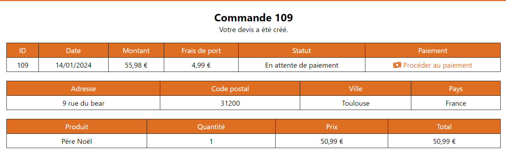

= DOCUMENTATION UTILISATEUR
:nofooter:
:toc: left
:icons: font

== Guide du site web

=== Crée un compte 

Pour crée un compte client, rendez-vous sur page : [.underline]#Connexion# en cliquant sur le lien disponible sur *l'en-tête* et cliquer sur le bouton : [.underline]#Créer un compte chez DisguiseHub# pour être redirigez vers le formulaire de création d'un compte : +
Saissisez ensuite les différent champs et valider en cliquant sur le bouton : *Valider* +

  +

.La création d'un compte DisguiseHub ne peut être validée si l'un des cas suivant n'est pas respecter : 

. Le champs _mot de passe_ doit contenir au minimum 8 caractères, sachant qu'il doit y avoir au minimum 
.. une majuscule
.. une minuscule
.. un caractère spécial

=== Se connecter à un compte

Pour se connecter à un compte client, rendez-vous sur la page : [.underline]#Connexion# en cliquant sur le lien disponible sur *l'en-tête* et entrez les informations demander, à savoir le mail et le mot de passe. +

  +

Au clique du bouton : [.underline]#Se connecter#, si ces deux informations ne sont pas erroné la connection est établie. +

=== Recherche et consulter des produits

Pour consulter les produits d'une catégorie spécifique, sélectionner celle-ci dans le sous-menu de *l'en-tête* +

  +

  +

Pour rechercher un produit spécifique, utilisez la loop disponible à gauche de *l'en-tête* qui va vous redirigez vers une page dans laquelle sera présent les produits correspondant à votre recherche : +

  +

  +

WARNING: La recherche peut échouer, votre produit n'existe peut-être pas ou vérifiez l'ortographe 

=== Ajouter et consulter des produits dans son panier

WARNING: Pour utiliser cette fonctionnalité, l'utilisateur doit être connecté à un compte

Pour ajouter un produit à son panier, le client doit dans un premier temps se rendre sur la page des produits et cliquer sur le bouton : [.underline]#Ajouter au panier# du produit désirer (une alerte s'affiche) : +

  +

  +

Pour consulter les produits de son panier, le client doit se rendre sur la page de son panier en cliquant sur le logo représentatif sur *l'entête* : +

  +

  

=== Gérer les produits dans son panier 

==== Modifier la quantité d'un produit

WARNING: Pour utiliser cette fonctionnalité, l'utilisateur doit être connecté à son compte

Pour modifier la quantité d'un produit dans son panier, le client doit se rendre dans son espace panier.
Depuis cette page,il peut modifier la quantité de ses produits en cliquant sur le bouton *-* ou *+*, la quantité du produit sera modifié :

image:./image/modification.png[Modification de la quantité d'un produit]

==== Supprimer un produit de son panier

WARNING: Pour utiliser cette fonctionnalité, l'utilisateur doit être connecté à son compte

Pour supprimer un produit de son panier, le client doit se rendre dans son espace panier.
Depuis cette page, en cliquant sur le bouton *-*  du produit, celui-ci sera supprimer de son panier.

=== Réaliser une commande

WARNING: Pour utiliser cette fonctionnalité, l'utilisateur doit être connecté à son compte et posséder un panier

Pour réaliser une commande à la suite de la création d'un panier, le client doit se rendre dans la page [.underline]#panier.php# ou il devra cliquer sur le bouton *commander* : 

image:./image/Commander.png[Bouton passer la commande]

Il sera rediriger vers une page dans laquelle sera présente un devis récaputilatif de sa commande ainsi qu'une procédure de paiement auquel il aura le choix entre trois moyens de paiement : 

=== Contacter DisguiseHub

WARNING: Pour utiliser cette fonctionnalité, l'utilisateur doit être connecté à son compte

Pour contacter DisguiseHub, le client devra se rendre en bas de la page d'accueil et cliquer sur *Aide et contact* : 

=== se connecter à un compte Administrateur

Pour se connecter à un compte Administrateur, rendez-vous sur la page : [.underline]#Connexion#. +
Depuis cette page, saisissez les informations administrateur dans le formulaire : +

  +

Si les informations saisies sont correct, l'utilisateur est redirigez vers une page dans laquelle sont présent des boutons permettant respectivement de redirigez vers les pages pour faire le CRUD des produits : 

  +

=== Gérer les produits (CRUD des produits)

WARNING: Pour utiliser cette fonctionnalité, l'utilisateur doit être connecté à un compte administrateur. 

Pour faire le CRUD des produits, l'administrateur doit cliquer sur le lien *administration* dans le menu de gauche de la page : 

  +

ce qui aura pour effet de le redirigez vers une page dans laquelle la liste de touts les produits est présente dans un tableau :

  +

Depuis cette page, l'Administrateur aura la possibilité de faire trois actions différentes : +

* Ajouter un produit
* Modifier les informations d'un produit
* Supprimer un produit

La fonctionnalité permettant d'ajouter un produit redirige l'administrateur vers une page dans laquelle est présente un formaulaire dans lequel il est invité à entrer les nouvelles informations : 

  +

